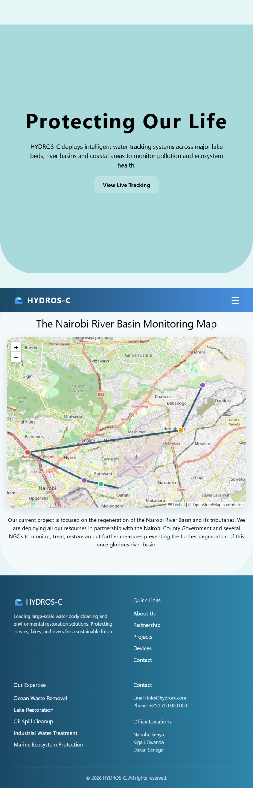

# HYDROS-C
This is a large water body regeneration company based project. It mainly focuses on hypothetical trackers placed on a now current project, the Nairobi River Basin that helps in monitoring the river conditions in order to curb the rapid pollution.

It also focuses on it's past projects and measures to help reduce community involved ignorance in the participation of waste release in our waters.

## DESCRIPTION

This project mainly focuses on JavaScript elements accompanied with other technical elements for support.

* HTML: this was used as the skeleton body for my project pages giving structure for JS access.

* CSS and Tailwind: for styling

* Cloudflare and UNPKG: for smooth deployment of my static page and access to leaflet for map tiles respectively

* JAVASCRIPT
   * DOM manipulation
   * Event Handling to capture users actions 
   * Local storage for persistent storage of data and the fetching of it 
   * Asynchronous programming especially on animations on time delays, AJAX 
   * Fetching APIs and error handling
   * AOS and other animation libraries

* JSON  

The page is fully responsive, a clear and readable topography, animation use, cards, images, compatibility of the content to the company, styling and use of blending colors. 

## PAGE


  ### The Repository
  ``` bash
https://github.com/delarum/HYDROS-C.git
  ```

## Technologies used
~ HTML

~ CSS

~ Tailwind

~ JS

~ JSON

~ GIT and GitHub

## Known bugs
None

## Support and Contact Information
**Email:** delarum7@gmail.com

**Phone Number:** 0792651083


